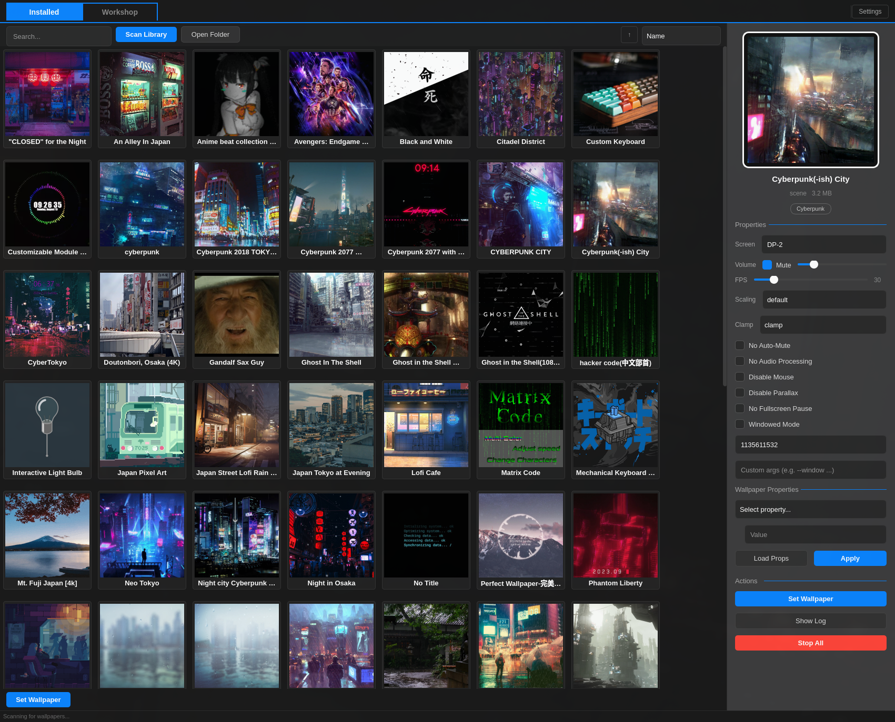

# Open Wallpaper Engine for Linux

**[English](README.md)** | **[繁體中文](README.zh-TW.md)** | **[日本語](README.ja.md)**

A modern, feature-rich GUI for [linux-wallpaperengine](https://github.com/Almamu/linux-wallpaperengine), inspired by [Open Wallpaper Engine for macOS](https://github.com/haren724/open-wallpaper-engine-mac).

> I encountered various problems on GNOME and KDE. I recommend using Linux Wallpaper Engine on tiling window managers such as i3, Hyprland, and bspwm. For KDE, try this [plugin](https://github.com/catsout/wallpaper-engine-kde-plugin#build-and-install) instead.

## Features

- **Mac-style split panel layout** — Left content area + right preview panel with wallpaper details, properties, and controls
- **Tabbed interface** — Installed / Workshop / Settings tabs in a top bar
- **Steam Workshop integration** — Browse, search, filter by tags (rating, type, genre), and download wallpapers directly via steamcmd
- **Steam Web API search** — Sort by trending, most recent, most popular, or most subscribed
- **steamcmd authentication** — Login with password, Steam Guard, or cached sessions
- **Wallpaper library scanner** — Auto-discovers wallpapers from Steam, Flatpak, and Snap install paths
- **Live wallpaper properties** — Load and edit wallpaper-specific properties (colors, speeds, toggles) from the preview panel
- **Per-wallpaper settings** — Screen selection, volume, FPS, scaling, clamping, mouse/parallax/fullscreen-pause toggles
- **Windowed mode** — For KDE/GNOME compositor compatibility
- **File system watcher** — Auto-refreshes library when wallpapers are added/removed
- **System tray** — Minimize to tray, quick access to Workshop
- **Auto-restore** — Remembers and restores your last wallpaper on startup
- **i18n** — Multilingual support (English, 繁體中文, Deutsch, Español, Français, Русский, Українська)

## Screenshots



## Installation (Arch Linux / Manjaro)

The easiest way is to install via AUR. This will automatically install the backend (`linux-wallpaperengine`) and all dependencies.

```bash
yay -S simple-linux-wallpaperengine-gui-git
```

## Installation (Nix)

**Flake Install (Recommended)**

Add to your flake inputs:
```nix
inputs = {
  simple-wallpaper-engine = {
    url = "github:Unayung/simple-linux-wallpaperengine-gui";
    inputs = {
      nixpkgs.follows = "nixpkgs";
      home-manager.follows = "home-manager";
    };
  };
};
```

Then in your home-manager config:
```nix
{inputs, ...}: {
  imports = [inputs.simple-wallpaper-engine.homeManagerModules.default];
  programs.simple-wallpaper-engine.enable = true;
}
```

**Imperative Install**
```bash
nix profile install github:Unayung/simple-linux-wallpaperengine-gui
```

## Manual Installation

### 1. Prerequisites (The Backend)

This is a GUI frontend — you **must** install [linux-wallpaperengine](https://github.com/Almamu/linux-wallpaperengine) first. If you installed from AUR, it comes as a dependency automatically.

**Arch / Manjaro:**
```bash
yay -S linux-wallpaperengine
```

**Debian / Ubuntu / Fedora (Build from Source):**

See [detailed instructions](https://github.com/Almamu/linux-wallpaperengine#compiling):
```bash
# Debian/Ubuntu
sudo apt install build-essential cmake libx11-dev libxrandr-dev liblz4-dev

# Fedora
sudo dnf install cmake gcc-c++ libX11-devel libXrandr-devel lz4-devel

# Build
git clone https://github.com/Almamu/linux-wallpaperengine.git
cd linux-wallpaperengine && mkdir build && cd build
cmake .. && make && sudo make install
```

### 2. Install the GUI

```bash
git clone https://github.com/Unayung/simple-linux-wallpaperengine-gui.git
cd simple-linux-wallpaperengine-gui
chmod +x install.sh
./install.sh
```

### 3. Usage

```bash
./run_gui.sh
```

Start minimized to system tray:
```bash
./run_gui.sh --background
```

## Steam Workshop Setup

To browse and download wallpapers from the Steam Workshop:

1. **Install steamcmd** — `yay -S steamcmd` (Arch/AUR) or see [Valve's guide](https://developer.valvesoftware.com/wiki/SteamCMD)
2. **Get a Steam Web API key** — Free at [steamcommunity.com/dev/apikey](https://steamcommunity.com/dev/apikey)
3. Open the **Workshop** tab, log in with your Steam account, and enter your API key

> You must own Wallpaper Engine on Steam to download workshop items.

## Troubleshooting

**"linux-wallpaperengine not found"**
Ensure the backend is installed. Run `linux-wallpaperengine --help` to verify.

**Wallpapers not showing?**
Click **Scan Library** on the Installed tab, or use **Open Folder** to manually select a wallpaper directory. The app searches standard Steam paths including `~/.local/share/Steam`, `~/.var/app/com.valvesoftware.Steam`, and `~/snap/steam`.

**steamcmd not found?**
On Arch Linux, install from AUR: `yay -S steamcmd`. The app will auto-detect it, or you can manually browse to the binary from the Workshop tab.

## Project Structure

```
wallpaper_gui.py       # Main application (PyQt6)
steamcmd_service.py    # steamcmd wrapper (auth, downloads)
workshop_api.py        # Steam Workshop API client
process_manager.py     # Wallpaper process lifecycle
locales/               # i18n translation files (en, zh-TW, de, es, fr, ru, uk)
```

## Related Projects

- **[Open Wallpaper Engine for macOS](https://github.com/Unayung/wallpaper-engine-mac)** — Our patched macOS version with scene wallpaper rendering and web wallpaper fixes. The Workshop integration and UI design in this Linux version were ported from it.

## Credits

- Backend: [linux-wallpaperengine](https://github.com/Almamu/linux-wallpaperengine) by Almamu
- Original GUI: [simple-linux-wallpaperengine-gui](https://github.com/Maxnights/simple-linux-wallpaperengine-gui) by Maxnights
- macOS upstream: [Open Wallpaper Engine](https://github.com/haren724/open-wallpaper-engine-mac) by Haren
